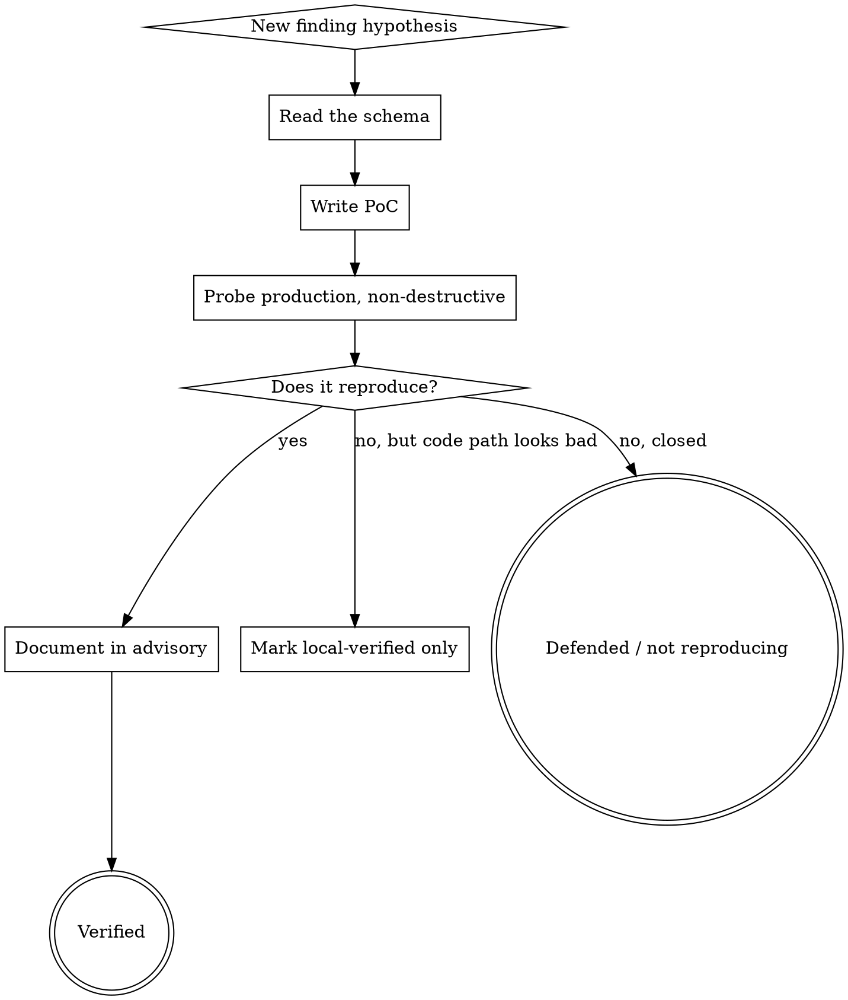

# Authorized Penetration Testing Runbook

This skill captures the discipline needed to run an authorized engagement end-to-end without embarrassing yourself or the maintainer. Every technique below comes from real engagements where the wrong call cost time, trust, or both.

## Before you touch production

Authorization is binary. You either have it in writing or you don't. Before any traffic to production:

- **Get the scope in text.** Maintainer DM, email, GHSA collaborator invite, written bounty scope — any of these qualifies. Save the artefact; don't rely on memory.
- **Pin the scope to what the maintainer actually said.** "Audit the open-source project" ≠ "audit every deployment." If the scope names a specific branch, a specific host, or specific APIs, everything else is out-of-scope even if reachable.
- **Default to non-destructive.** Read, don't write. Cost-inflation (mass PDF/render requests) and email-flood are destructive even when the bug is valid — ask first.
- **No third-party damage.** If your PoC reads data belonging to users who aren't the maintainer, redact PII in your reports and keep raw captures local, not in the advisory.

### When a subagent or safety check balks at the scope

Subagents will occasionally refuse tasks citing missing authorization. The unblock pattern:

1. Quote the scope artefact verbatim inside the subagent prompt, not outside it.
2. Add a verification pointer: "Authorization can be verified via `gh api /repos/{owner}/{repo}/security-advisories/{id}` — I'm listed as a collaborator."
3. Name what you're NOT doing (PII extraction, mass harvest, destructive probes) so the refusal model can see the shape of the task.

If the subagent still refuses and the task is truly in-scope, do it yourself rather than argue. Safety friction is better than unauthorised action in ambiguity.

## Probing discipline



Each finding is a **hypothesis**. You don't "find" bugs — you propose them, then try to falsify them against the running target. A finding is worth writing up only after the PoC actually fires on prod (or is clearly code-path-reachable on a local clone of the exact deployed SHA).

### Schema-first PoC construction

**Read the Zod / OpenAPI / Drizzle schema before crafting payloads.** A payload targeting the wrong path produces 400s that look like the bug is defended when it isn't.

```bash
# Before probing any resource-shape endpoint:
find . -name "*.ts" -path "*schema*" -o -path "*dto*" | head -5
grep -rn "z\.object\|createSelectSchema\|pick(\|omit(" <schema-file>
```

A wasted probe iteration on the wrong nested path is a 10-minute tax; reading the schema first is a 2-minute tax that pays back every PoC after it.

### Rate-limit yourself

Default to 2–3 req/s across all probes. Faster looks like an attack; slower is boring for the maintainer to audit. Never use multithreaded harvesters without explicit go-ahead.

If you hit a rate limit, **stop and write it up as a positive observation**. Don't rotate IPs, don't tune timings to dodge it — that's the point where research ends and evasion begins, and it's also the point where the maintainer loses trust.

### Authenticated-probe account hygiene

Use clearly-labelled throwaway accounts so the maintainer can grep their DB after the engagement:

- Email: `security-research-{uuid}@<unlikely-tld>.test` or similar clearly non-real
- Name / display-name: `Researcher` or `SecResearch`
- Username: unique + includes a project marker (`secr-{project-short}-{uuid8}`)

Pickle the session cookies so follow-on probes don't need to re-auth (see `references/poc-templates.md` for the 15-line auth-bootstrap template).

## The hard lesson — verify every claim, twice

**Each sentence in an advisory is a load-bearing claim.** A wrong claim costs the maintainer time + makes you look sloppy + trains them to ignore the report.

Two failure modes to plan for:

1. **The claim was never true** — often from a probe script bug (cached headers, broken session, wrong host). If a probe returns "all defences missing" on a mature project, suspect your probe before writing up the finding.
2. **The claim was true when you first probed, but the maintainer is actively patching during your engagement.** Partial mitigations ship silently. A rate-limit that didn't exist on day 1 may be present on day 3.

Defences:

- Before calling a header / route / response "missing", dump the raw response **verbatim** into the conversation. `curl -sI $url` or `r.headers.items()`. Compare two independent runs from two different source IPs if possible.
- Before a severity-defining claim lands in the advisory, write out the exact PoC and the exact observed output in the finding body. If you can't reproduce with copy-pasted curl, don't write it up.
- On re-verification rounds, check **every** claim, not just the ones you suspect are wrong.
- When you find a claim was wrong, **retract it in the advisory with a retraction paragraph at the top of the affected section**. Don't silently delete and hope no one noticed.

### Living-target detection

If the maintainer is triaging while you're verifying, state can change mid-session. Detect it with a short snapshot probe that runs at the start of every verification round:

```python
# snapshot_probe.py — diff-able baseline
targets = [
  ("security headers",  lambda: probe_headers(BASE+"/")),
  ("sign-in rate limit",lambda: count_429s(N=10, endpoint="/api/auth/sign-in/email")),
  ("origin IP",         lambda: resolve_origin(BASE)),
  ("version echo",      lambda: probe_health(BASE)),
]
print(json.dumps({label: probe() for label,probe in targets}, indent=2))
```

Save the JSON. `diff` against the prior round's output before claiming anything "still reproduces" or "is now mitigated."

### Mark findings by verification tier

Every finding in the advisory gets a tier tag:

| Tier | Meaning | Example wording |
|---|---|---|
| **verified on prod** | Reproduced today on the target deployment | "Verified on prod {date}: {HTTP response snippet}" |
| **verified locally** | Reproduced on a local clone of the deployed SHA | "Verified local Docker-compose; deployed build match confirmed via `git log -1 --format=%H`" |
| **code-inspected** | Code path matches description; no runtime proof | "Code path at `<file:line>` matches pattern; not re-tested runtime in this round" |
| **partially mitigated** | Some guard is present, bypassable under conditions | "Present but threshold at ~N; see table" |

Tier mismatch is a common credibility leak: don't write "verified" when you mean "inspected."

## Writing the advisory via `gh api`

GHSA advisories don't have a public comments API — the description is the only editable field that other collaborators see.

### The edit loop

```bash
# 1. Check state
gh api /repos/{OWNER}/{REPO}/security-advisories/{GHSA_ID} \
  --jq '{state, summary, desc_len: (.description | length), cwe_ids}'

# 2. Pull description for in-place editing (don't accumulate v1/v2/v3 files)
gh api /repos/{OWNER}/{REPO}/security-advisories/{GHSA_ID} \
  --jq '.description' > /tmp/advisory.md

# 3. Edit /tmp/advisory.md with your tool of choice

# 4. PATCH. --input takes a JSON file to avoid quote-escaping hell.
python3 -c "
import json
desc = open('/tmp/advisory.md').read()
open('/tmp/patch.json','w').write(json.dumps({
  'description': desc,
  'cwe_ids': ['CWE-200','CWE-284','CWE-307','CWE-601','CWE-918'],
}))
"
gh api -X PATCH /repos/{OWNER}/{REPO}/security-advisories/{GHSA_ID} \
  --input /tmp/patch.json \
  --jq '{updated_at, desc_len: (.description | length)}'
```

Always round-trip through `gh api … --jq .description > /tmp/advisory.md` before each edit — don't accumulate `advisory_v1.md`, `advisory_v2.md`, etc. The GHSA state is authoritative; your local copy goes stale the moment another collaborator edits.

### Advisory structure that works for long reports

1. **Summary** at the top — one sentence for each Critical / High. Cross-reference findings by number.
2. **Numbered findings**, each with: endpoint + method, root cause (with `file:line`), PoC (minimal bash/python that actually reproduces), additional concerns, suggested fix. Don't bury severity.
3. **Ruled out** — things you tested that *aren't* vulnerable. Surprisingly valuable; saves the maintainer re-auditing those paths.
4. **Scope notes** — exactly which branch/SHA/deployment you tested, request count, who knows about the work.
5. **Proposed patches** (optional) — patch file contents in folded `<details>` blocks plus `git am` instructions.

### CWE tagging

Pick the 3–7 CWEs that actually describe the findings, not a kitchen sink. Common for web-app advisories:

- CWE-200 — info disclosure
- CWE-284 — access control
- CWE-287 — authentication
- CWE-307 — brute-force resistance
- CWE-601 — open redirect
- CWE-693 — protection-mechanism failure
- CWE-918 — SSRF
- CWE-1021 — UI layer restriction / frame-ancestors
- CWE-1104 — use of unmaintained / outdated components

### Size budget

GitHub advisories soft-limit around 65 KB. At ~25 KB you can still add a couple of findings + inline patches; above 50 KB start pruning verbose PoCs in favour of links to gists (private) or inline folded `<details>`.

## Patch delivery when the fork is inaccessible

The GHSA web UI offers "Create a temporary private fork" to collaborate on fixes. **That fork is gated to whoever clicked the button — usually the maintainer — not automatically extended to advisory collaborators.** Attempting to `git clone https://github.com/{owner}/{repo}-ghsa-xxx.git` from any other account returns `Repository not found`.

If you don't have push access to the fork:

1. Clone the public repo, branch off the relevant SHA.
   ```bash
   git checkout -b advisory-fix-1 origin/main
   ```
2. Apply focused commits with the advisory ID in each message (see "Commit hygiene" below).
3. Run the quality gates. Commit only if they pass.
4. Export the commits as patches:
   ```bash
   # ALWAYS use a range, never `-N` (that uses HEAD's ancestors counting backwards
   # and silently picks the wrong commits when your base is far back).
   git format-patch origin/main..HEAD -o patches/
   ```
5. PATCH the advisory description to append a "Proposed patches" section with:
   - Concise summary of each commit (what it closes, net line delta, files touched)
   - Explicit list of what's **not** in the patchset and why
   - Full `.patch` contents in `<details><summary>…</summary>\n\n\`\`\`patch\n…\n\`\`\`\n</details>` blocks
   - `git am < 0001-….patch` instructions
   - An offer to push to the fork if granted access

**Do NOT** create a public fork with the patches — that leaks the vulnerability before the embargo lifts. **Do NOT** post patches to a Gist linked from the advisory — Gist URLs are indexable and the advisory can leak to repo admins who don't need the raw diff.

## Quality gates before commit

Non-negotiable. Run all three, all green, before any commit goes in:

```bash
# 1. Type-check, errors from src/ only (ignore vendor/generated noise)
pnpm exec tsgo --noEmit 2>&1 | grep '^src/' | head -20      # or tsc --noEmit

# 2. Tests — every single one, don't cherry-pick
pnpm test                                                    # or npm test / cargo test / etc

# 3. Diff self-review — read it like a reviewer, not an author
git diff --stat
git diff <each-touched-file>
```

**If typecheck / tests fail, fix before committing, never after.** "I'll fix it in the next commit" is how half-working patches ship.

### When a library option is speculative

If you're using a plugin / framework option you haven't seen in the types (e.g., a hypothetical `redirectURIValidator` you think exists), verify before shipping:

```bash
# In-repo, with deps installed:
node -e "console.log(Object.keys(require('<pkg>').default ?? require('<pkg>')))"
# or open the package's .d.ts:
ls node_modules/<pkg>/dist/*.d.ts
grep -l 'redirectURIValidator' node_modules/<pkg>/dist/*.d.ts
```

If the option isn't there, pick a pattern that's clearly supported (middleware hook, config boolean) and document the alternative as a TODO in the commit body rather than shipping speculative config.

### Dev-dependency revert hygiene

If you add a dev dependency for a probe (JSDOM harness, fuzz harness), revert the lockfile change before committing the security fix:

```bash
git checkout -- package.json pnpm-lock.yaml
# Or use a throwaway install in /tmp:
mkdir /tmp/probe && cd /tmp/probe && npm init -y && npm install jsdom dompurify
# run probe there, delete after
```

A stray `jsdom` in `devDependencies` of a security-fix PR leaks that you ran a sanitiser harness and invites questions about whether you shipped it (you didn't).

## Patch-now vs advise-only decision framework

Not every finding warrants a patch in your PR. Rule of thumb:

**Ship the patch if all three hold:**

- Diff is under ~100 lines
- No new runtime dependencies
- Existing test suite covers the regression case (or you can add a focused unit test)

**Advise only (suggested fix in advisory, no code) when any of:**

- The fix needs an architectural decision you can't make (rate-limit storage backend, Redis vs in-memory vs edge-level)
- The fix needs a big refactor (write a real CSS AST parser, migrate to a different sanitiser)
- The fix is infra, not code (firewall rules, origin-IP rotation, container image pins, HSTS preload submission)
- The fix touches user-visible product behaviour (removing an API the maintainer's users may depend on) — offer the patch but flag that it's breaking

Writing up "here's the suggested fix and why" is a real deliverable. Shipping a half-thought patch that gets rejected is worse than shipping clear advice.

## Commit hygiene for security fixes

- **One commit per logical fix group.** Reviewers cherry-pick; small focused commits make triage easy.
- **First line format:** `security({ADVISORY_ID}): <imperative summary>`. Mirror severity word if the whole commit is Critical.
- **Body template:**
  ```
  security({ADVISORY_ID}): <imperative summary>

  Fixes advisory findings:
  - #N (Severity) <one-line>
  - #M (Severity) <one-line>

  <Root-cause paragraph: why the old code was wrong, not just what it did.>

  <Why this approach and not the obvious alternative. Reviewers want
  to know why you did NOT take the obvious-looking shortcut.>
  ```
- **Inline code comments citing the advisory:** when you add a defensive branch or delete a trusted-looking path, leave a one-liner (`// ADVISORY_ID: access control enforced in-service because the upstream middleware is forgeable`). Future readers asking "why is this so defensive" save 30 minutes.

## Working in a codebase you didn't write

- **Read the routing layer end-to-end before patching.** A broken middleware often means the wrong layer to fix. Don't patch a middleware to make a check work when the real answer is "don't trust client-settable headers for authz; move the check into the service."
- **When you remove a code path, check every caller.**
  ```bash
  # Before:
  grep -rn "<symbol>" src/ --include="*.ts" --include="*.tsx"
  # After:
  git diff --stat ; grep -rn "<symbol>" src/   # expect fewer hits
  ```
- **Preserve the "happy path" that the maintainer's users depend on.** If you remove a public endpoint that an internal flow depends on, re-add it gated by the right primitive (HMAC token, server-side-call context, whatever the codebase already provides).
- **Prefer tightening over deleting.** Tighten a config flag before removing the feature. Removal is a breaking change for anyone already relying on it.

## Technique toolkit

### SSRF error-shape oracle

Many apps accept user-controlled URLs (webhook targets, AI `baseURL`, picture URL, RSS feed). The server's outbound fetch normally returns generic 502/BAD_GATEWAY, but the inner message differs by failure mode:

| Target type | Typical error string | What it means |
|---|---|---|
| External unreachable | `ENOTFOUND {host}` | DNS failure |
| Internal service name | `other side closed` | TCP handshake ok, protocol mismatch (e.g. Postgres wire) |
| Loopback + closed port | `ECONNREFUSED 127.0.0.1:{port}` | Host up, no listener |
| Reachable HTTP, no route | `Not Found` / `NOT FOUND` | Service up, no matching path |
| Reachable, wrong host header | `Invalid Host header` | Server distinguishing host |
| Slow | hang past timeout | Filtered / offline |

Four+ distinguishable error classes → port-scan primitive over any IP:port the server can reach. Enumerate internal-network topology systematically:

```python
targets = [
  ("external OK",           "https://example.com"),
  ("localhost/app",         "http://localhost:3000"),
  ("localhost/pg-port",     "http://localhost:5432"),
  ("pg by service name",    "http://postgres:5432"),
  ("redis by service name", "http://redis:6379"),
  ("closed port",           "http://localhost:65500"),
  ("metadata service",      "http://169.254.169.254/"),
]
# record the error string for each; diff against the closed-port baseline
```

### Version fingerprint via SSRF

Once you have outbound-fetch reachability (via a `picture.url`-style parameter that echoes fetched content, or an SSRF that returns base64'd response bodies), point it at the server's own `/api/health` / `/status` / `/metrics` endpoint. Those almost always leak runtime versions: Node version, DB version, headless-browser version, V8 version, library versions.

Cross-reference against upstream stable releases. An image pinned to `:latest` but actually resolving to a pre-stable build (Beta, Canary, RC, or just "two minor versions behind") often has multiple unpatched remote-triggerable CVEs that would turn a read-only SSRF into renderer RCE.

### Rate-limit posture measurement

```python
from collections import Counter
codes = []
t0 = time.time()
for i in range(N):
    r = probe()   # same request body each time
    codes.append(r.status_code)
dt = time.time() - t0

cnt = Counter(codes)
first_429 = next((i for i,c in enumerate(codes) if c==429), None)
# categorize:
#   not-mitigated  → zero 429s across N
#   partial        → some 429s, first at index > 5
#   strong         → first 429 at index ≤ 3
```

Run N = 20–60 depending on expected window. Always sleep ≥60s between different rate-limit probes so earlier runs don't contaminate the bucket.

### Sanitiser audit harness

The right failure test for an HTML sanitiser is not "does the output string contain `<script>`" — that misses cases where the sanitiser renames tags, moves content, or inserts event handlers during DOM normalisation. The right test parses the output with JSDOM and asks: did any `<script>` element exist? Any attribute starting with `on`? Any `javascript:` URL in href/src?

See `references/poc-templates.md` → "Sanitiser-bypass harness" for the exact 40-line script and the payload library that covers published mXSS vectors.

### Security-headers audit

Same trap as the sanitiser: running a regex on `curl -sI` output misses subtle cases like `Content-Security-Policy-Report-Only` (report-only mode counts as "has a CSP" for some questions, "doesn't enforce" for others). Dump every header verbatim, then classify:

- Present + enforcing → safe to call defended
- Present + report-only → mitigation partial; worth flagging as "promote to enforcing"
- Missing → flag, but double-check that you requested the right route (`/uploads/*` often has different headers than `/`)

## Dispatching subagents

When to delegate to a general-purpose research subagent vs. do it yourself:

| Task | Delegate to subagent? | Why |
|---|---|---|
| CVE cross-reference for a specific version | **yes** — parallel search across sources | Agents searching NVD + vendor-advisory + news simultaneously beat manual sequential search |
| Dependency version research (latest stable, release date, changelog) | yes | Same reason |
| Code-path tracing inside the repo | **no** | Your context already has the repo; dispatch adds latency and context loss |
| PoC writing | **no** | Tight iteration loop; dispatch overhead kills efficiency |
| Reading the maintainer's prior GHSA advisories for tone/format | yes | Narrow research task, bounded result |

Prompt template for CVE research dispatch:

```
Research CVEs affecting {product} version {X.Y.Z}.

Context: {one-paragraph on the deployment — what the component is used for,
what attacker-controlled input it touches, what environment it runs in}.

I need: (a) whether this exact version was a stable release or pre-release;
(b) any remote-triggerable RCE / sandbox-escape / auth-bypass CVEs patched
in later versions that would affect this build; (c) a recommended pin /
upgrade path.

Focus on: remote-reachable issues only (not UI-origin, not chrome://-only).
Cite CVE numbers with one-line descriptions. Cross-reference NVD + vendor
advisory + changelog. Return under 300 words.
```

## Anti-patterns

| Thought | Reality |
|---|---|
| "The finding is obvious from code inspection, no need to re-probe prod" | Partial mitigations happen silently. Re-probe. |
| "I'll fix the typecheck/test in the next commit" | No. Fix before commit. |
| "The maintainer will tolerate one wrong claim" | You erode trust with each wrong claim. Zero is the target. |
| "The fork is private, I'll just push my local branch there" | `Repository not found`. The fork is gated to its creator. |
| "I'll post the patches as a Gist" | Gist URLs are indexable; the embargo breaks silently. |
| "The scope said 'audit'; I can read a few other users' data" | No. Redact PII and keep raw captures local. |
| "This is just a test account probe" | Rate-limit yourself anyway. 2–3 req/s default. |
| "Rate limiter hit me — I'll rotate IPs" | Stop. You just moved from research to evasion. |
| "I'll mass-harvest to demonstrate scale" | Ask first. Scale-demo value is marginal vs. single-PoC proof. |
| "`git format-patch -2` is fine" | It picks the wrong commits when base is far back. Always use `base..HEAD`. |
| "I'll just add a dev dep for the probe" | Revert the lockfile before committing the fix. |
| "The subagent refused, so I can't do the task" | Quote the scope artefact verbatim in the prompt, or do it yourself. |
| "I know Plugin X has option Y" | Check the `.d.ts`. Speculative options ship broken configs. |

## Finishing the engagement

When the advisory is accurate, patches land cleanly, and tests + typecheck are green:

- Push patches to the fork (if you have access) or inline in the advisory with `git am` instructions.
- Post a wrap-up comment with: what's verified, what's defended (ruled-out list), what's intentionally not patched in this PR and why, pointer to any follow-up work you owe.
- Clean up local artefacts. `git status` should be empty on the public repo; `ls /tmp/{project}-*` should only contain owner-redacted evidence.
- Ask once about CVE / credit preferences. Some maintainers want to assign CVEs themselves; some want the request to come from you.
- Wait for triage; don't ping more than once a week. Silence after a clean wrap-up is normal.

## Calibration — what a normal second-pass looks like

Rough ratios you should expect on a second verification round over ~10 findings:

- ~1 **retraction** (a claim that turned out wrong on re-check)
- ~1–2 **severity downgrades** (partial mitigation landed between rounds)
- ~1 **upgrade** (finding turned out stronger than first documented)
- ~1 **new finding** discovered while re-verifying something adjacent

If your second pass produces zero movement on any of these axes, either you're not re-verifying hard enough or you got genuinely lucky. Plan for the movement; don't be surprised by it.
