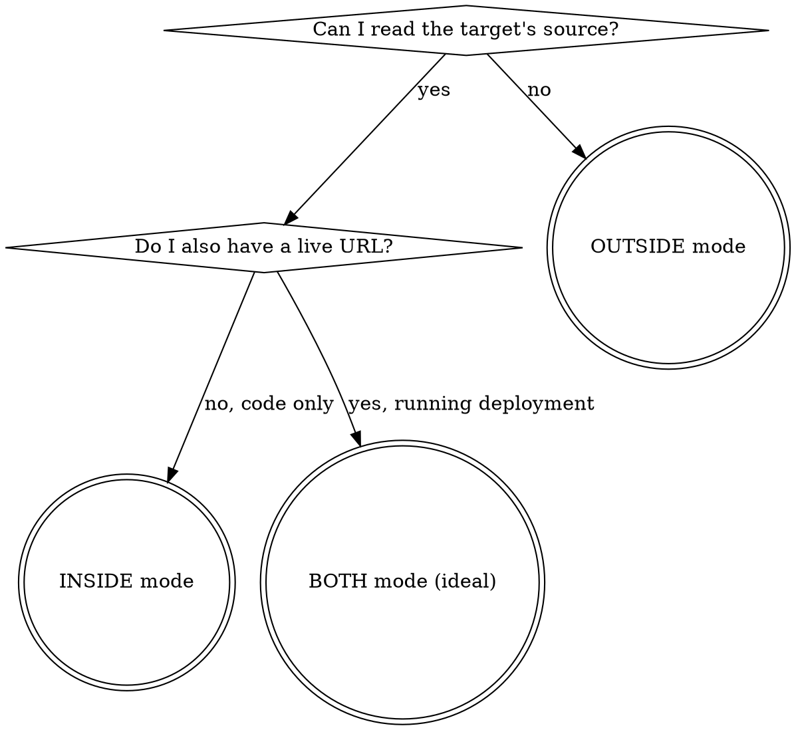

# Web App Security Audit

Find the bugs before attackers do. Works equally well for:
- **Your own codebase** — defensive audit before you get hacked
- **A project you have written authorization to audit** — GHSA collaborator, bug-bounty scope, CTF engagement

## First — what mode are we in?



**Check signals in this order:**

| Signal | Mode |
|---|---|
| `ls` shows `package.json` / `Cargo.toml` / `go.mod` / `pyproject.toml` / `Dockerfile` / `src/` in cwd | inside (filesystem access to target) |
| User says "my project", "our codebase", "audit this repo", pastes code | inside |
| User gave only a URL / hostname / API endpoint, no filesystem access | outside (black-box) |
| Filesystem access AND a live URL of the same project | **both — most powerful** |
| Written scope from the maintainer of a project you don't own | outside or both (check cwd) |

**Before probing production from outside, you need authorization in writing.** Scope artefact (maintainer DM, GHSA collaborator invite, bounty scope). Without it, stop.

---

## INSIDE mode — source-code audit checklist

Read the code before doing anything else. Every bug found here is free (no prod traffic, no scope questions). Work in this order — cheap first:

### 1. Dependency CVEs and version pins

```bash
# Node
npm audit --production                          # or pnpm audit, yarn audit
grep -E '"(react|next|express|fastify|better-auth|drizzle)":' package.json
# Python
pip-audit || safety check
# Container
grep -E 'FROM\s+.+:latest|FROM\s+.+:\d' Dockerfile*   # :latest is a smell
```

Red flags: `:latest` image tags, lockfile missing, packages named `*-fork` or `@types/*@0.0.x`, any high-severity advisory from `npm audit`.

### 2. Secrets leaked into the repo

```bash
# Obvious
grep -rInE '(SECRET|TOKEN|KEY|PASSWORD|PRIVATE_KEY)\s*=\s*["'\''][A-Za-z0-9/+=_-]{16,}' \
  --include='*.{env,yaml,yml,ts,tsx,js,jsx,py,go,rs,json,toml}' .
# History
git log -p --all -S 'BEGIN RSA PRIVATE KEY' -S 'AKIA' -S 'sk-' -S 'xoxb-' | head -50
# .env checked in at any point
git log --all --full-history -- '**/.env*' | head
# Client-exposed secrets (Next.js / Vite / CRA)
grep -rIn 'NEXT_PUBLIC_\|VITE_\|REACT_APP_' src/ | grep -iE 'secret|private|key'
```

### 3. Authentication

```bash
# Password hashing
grep -rInE 'md5|sha1|crypto\.createHash\(.(md5|sha1).\)|bcrypt\.hashSync|scrypt' src/
# Session / cookie flags
grep -rInE 'httpOnly:\s*false|secure:\s*false|sameSite:\s*.none' src/
# JWT
grep -rInE 'algorithm:\s*.HS256.|none.\s*algorithm|jwt\.sign\(.+,\s*.(secret|password)' src/
# Timing-safe compare
grep -rInE 'password\s*[!=]=|token\s*[!=]=' src/   # should be timingSafeEqual
```

Look for: plain `==` on password/token comparisons, `md5`/`sha1` on anything secret, JWT signed with a client-available secret, `algorithm: "none"` accepted, session cookies missing `httpOnly` / `secure` / `sameSite`.

### 4. Authorization / IDOR — the endpoint-level check

The pattern: does **every** data-access query include an ownership predicate, or is there at least one endpoint that trusts the caller to pass a correct `id`?

```bash
# Find every DB query that takes an id
grep -rInE '\.where\(.*\.id,\s*input\.id\)|findOne\(\{\s*id:|SELECT .+ FROM .+ WHERE id\s*=' src/
# Then for each, check if it ALSO filters by userId / ownerId / currentUser
```

For each hit, ask: if an attacker passes a victim's id, does this return their data? The service layer is where this usually breaks.

Also look for forgeable "server-only" / "admin" checks based on request headers:

```bash
grep -rInE '(x-server|x-admin|x-internal|x-forwarded-for.*===\s*.127)' src/
```

Client-settable headers are not auth primitives.

### 5. Input validation / injection

```bash
# SQL: raw queries or template strings with user input
grep -rInE 'db\.(raw|query)\(.*\$|prisma\.\$queryRaw|sequelize\.query\(.*\$|\.exec\(.*\+' src/
# NoSQL (MongoDB $where, $function)
grep -rIn '\$where\|\.aggregate\(' src/ | head
# Command injection
grep -rInE 'child_process\.(exec|execSync)\(|\.spawn\(.+,\s*\{\s*shell' src/
grep -rInE 'os\.system\(|subprocess\.(call|run|Popen)\(.+,\s*shell=True' src/
# Path traversal
grep -rInE 'path\.join\(.+req\.|fs\.(readFile|createReadStream)\(.+req\.' src/
# Template / eval injection
grep -rInE 'render\(.+,\s*\{\s*\.\.\.(req|input)\.|eval\(|new Function\(' src/
```

### 6. XSS sinks and sanitiser config

```bash
# React
grep -rIn 'dangerouslySetInnerHTML' src/
# Vue
grep -rIn 'v-html' src/
# Generic DOM
grep -rInE 'innerHTML\s*=|document\.write\(|\.insertAdjacentHTML\(' src/
# Sanitiser config — the allowlist is usually the bug
grep -rInE 'ALLOWED_(TAGS|ATTR)|DOMPurify\.sanitize\(' src/
```

For every sanitiser call site, **read its config**. Wide `ALLOWED_ATTR` (`style`, `href`, `srcset`) plus wide `ALLOWED_TAGS` (`a`, `iframe`, `object`, `embed`, `svg`) = high probability of bypass. CSS `style="..."` plus unchecked `url()` = CSS-SSRF.

### 7. SSRF — server-side fetch of user-controlled URLs

```bash
grep -rInE 'fetch\(.+(req|input|body|params|query)\.|axios\.(get|post)\(.+(req|input)\.|got\(.+(req|input)\.|http\.get\(.+(req|input)\.' src/
grep -rInE 'urllib\.(request|urlopen)\(|requests\.(get|post)\(.+\+' src/
```

Every hit is a suspect. For each, check:
- Is the URL validated against an allowlist?
- Is redirect-following disabled?
- Is RFC-1918 / loopback / link-local / `169.254.0.0/16` blocked before connecting?
- Does the response body return to the caller (worse — content exfiltration) or is it discarded?

Pattern to hunt for specifically: **a user-controlled `image_url` / `avatar_url` / `webhook_url` / `callback_url` / AI `baseURL` / RSS feed / URL-preview field that the server fetches and returns some part of the response for.**

### 8. File upload and extraction

```bash
# Filename trust
grep -rInE 'multer|formidable|busboy|\.file\.name|originalname' src/
# ZIP slip in archive extraction
grep -rInE 'unzip|extract\(|\.tar\.|yauzl|adm-zip' src/
# MIME-type trust (client-set)
grep -rIn 'mimetype\s*===' src/
# Filename persisted as-is
grep -rIn 'path\.join\(.+\.originalname' src/      # almost always wrong
```

### 9. Cryptography misuse

```bash
grep -rInE 'Math\.random\(\)|Random\(\)\.(next|int)|rand\(\)' src/ | grep -iE 'token|code|id|secret'
grep -rInE 'crypto\.createCipher\(' src/             # deprecated, IV-less
grep -rInE 'ECB|DES|RC4|MD5' src/
grep -rInE 'timingSafeEqual|constant_time_compare' src/  # presence check; absence near auth = smell
```

`Math.random()` anywhere near a token, password-reset code, or session ID is game over.

### 10. Race conditions

```bash
# TOCTOU: check-then-act without transaction
grep -rInE 'findOne\(.+\).+\.create\(|SELECT.+INSERT' src/
# Transaction presence
grep -rInE 'prisma\.\$transaction|db\.transaction\(|BEGIN;' src/
```

Signup with unique-username check → insert, payment with balance check → debit, "claim once" invites, rate-limit-by-count — all classic TOCTOU.

### 11. Rate limiting on auth surfaces

```bash
grep -rInE 'rateLimit|rate_limit|ratelimit|slowDown|express-rate-limit|@upstash/ratelimit' src/
# Enumerate auth endpoints
grep -rInE 'sign-in|signin|login|register|forgot|reset.password|2fa|verify-otp|resend' src/ | head -40
```

For each auth endpoint, check whether there's a rate-limit wrapper. Missing = brute-force, credential-spray, email-flood vectors.

### 12. CORS and CSRF

```bash
grep -rInE 'cors\(|Access-Control-Allow-Origin|credentials:\s*true' src/
grep -rInE 'csrf\(|csurf|sameSite' src/
```

Red flags: `Access-Control-Allow-Origin: *` with `credentials: true`, `Origin` header used for auth decisions, sensitive mutations with no CSRF token or SameSite protection.

### 13. Docker / container / CI

```bash
grep -nE '^(FROM |USER |RUN |ENV |EXPOSE |COPY|ADD)' Dockerfile*
```

Red flags:
- `FROM .+:latest` (anyone can silently ship a malicious new build)
- No `USER` directive (runs as root)
- Secrets in `ENV` (build-time) or `ARG` that survive in layers
- `EXPOSE` with ports you don't serve from
- `ADD <url>` instead of `COPY` (fetches network content)
- Dev deps present in production image

```bash
# GitHub Actions: unpinned actions, PR-from-fork with secrets, self-hosted runners
grep -nE 'uses:.+@(main|master|v\d+)\s*$|pull_request_target|secrets\.' .github/workflows/*.yml
```

### 14. Environment variables reaching the client

```bash
# Next.js / Vite / CRA: anything starting with NEXT_PUBLIC_, VITE_, REACT_APP_ ships in the JS bundle
grep -rIn 'process\.env\.' src/ app/ 2>/dev/null | grep -vE 'NODE_ENV|NEXT_RUNTIME|VERCEL' | head -40
```

A `NEXT_PUBLIC_DATABASE_URL` or `VITE_STRIPE_SECRET` does happen.

### 15. Logic bugs — read the happy path

The grep patterns catch ~70% of bugs. The remaining 30% are logic bugs only found by reading:

- The authentication / session flow end-to-end
- The payment / billing flow end-to-end
- The multi-tenant isolation boundary (anywhere with `tenant_id` / `workspace_id` / `org_id`)
- Password reset + email verification flow
- Invitation / sharing flow

Read each as a full story. Ask at every step: what happens if the attacker controls this input?

See `references/source-audit-patterns.md` for expanded patterns and worked examples.

---

## OUTSIDE mode — black-box probing checklist

You have a URL + written scope. No source access. Work cheapest-first.

### 1. Attack surface enumeration (passive)

```bash
# Subdomains via certificate transparency — no traffic to target
curl -s "https://crt.sh/?q=%25.example.com&output=json" | jq -r '.[].name_value' | sort -u
# Wayback / historical
curl -s "https://web.archive.org/cdx/search/cdx?url=*.example.com&output=json" | jq -r '.[1:][] | .[2]' | sort -u | head -50
```

Pick subdomains for active probing; keep in scope.

### 2. Port scan + service fingerprint

```bash
# Only against hosts in scope
nmap -sS -sV -Pn -T3 --top-ports 200 target.example
# With version detection on management ports
nmap -sV -sC --version-intensity 5 \
  -p 22,80,443,2375,2377,3000,5432,6379,8080,9090,9200,27017,11211 \
  target.example
```

What to flag:
- Management ports open to internet: 2375/2377 (Docker), 6443/10250 (K8s), 5432 (Postgres), 6379 (Redis), 27017 (Mongo), 9200 (Elastic), 11211 (Memcached)
- Admin panels: 8080 (Traefik, Jenkins), 3000 (Grafana, Jenkins), 9090 (Prometheus), 5601 (Kibana)
- SSH with version banner

### 3. TLS configuration

```bash
# Single best tool
docker run --rm -ti drwetter/testssl.sh --fast https://target.example
# Or direct
echo | openssl s_client -connect target.example:443 -servername target.example 2>&1 \
  | openssl x509 -noout -dates -issuer -subject
```

Red flags: TLS 1.0 / 1.1 accepted, weak ciphers (RC4, 3DES), missing HSTS preload, cert from unusual CA, expiry < 30 days, wildcard covering too much.

### 4. DNS misconfiguration

```bash
# SPF / DMARC
dig +short TXT example.com | grep -iE 'spf'
dig +short TXT _dmarc.example.com
# Dangling CNAME → subdomain takeover
for sub in $(cat subdomains.txt); do
  dig +short CNAME "$sub.example.com"
done | grep -v '^$'
# CAA — missing = any CA that passes domain validation can issue
dig +short CAA example.com
```

Subdomain takeover: for each CNAME target (GitHub Pages, Heroku, Fastly, Azure, Shopify, S3 bucket) — if the target resource was deleted but the CNAME remains, an attacker can claim it.

### 5. Exposed admin / debug / backup paths

```bash
# Common paths — run as a batch
for p in .git/config .git/HEAD .env .env.bak .env.local .env.production \
         config.json config.yml backup.sql db.sql dump.sql \
         swagger swagger.json swagger-ui openapi.json openapi.yaml \
         admin administrator wp-admin phpinfo.php \
         metrics health healthz actuator actuator/env actuator/heapdump actuator/mappings \
         graphql graphiql api/v1 api/docs api/reference \
         .well-known/security.txt server-status server-info \
         rails/info/routes telescope horizon \
         _ignition/execute-solution \
         robots.txt sitemap.xml; do
  printf '%-35s %s\n' "$p" "$(curl -s -o /dev/null -w '%{http_code} %{size_download}B' "https://target.example/$p")"
done
```

Interesting: 200 on `.git/config`, `.env*`, `/actuator/*`, `/metrics`, `/api/auth/reference`, `/graphql` (introspection), `/admin` returning anything other than a 404.

### 6. Auth posture

See `references/poc-templates.md` §3 (rate-limit recipe). Quick version: 20 wrong-password attempts at `/sign-in`, count 429s. No 429 = credential-spray primitive.

### 7. Error-shape oracle → blind internal port scan

See `references/poc-templates.md` §4. Four distinct error classes (`ENOTFOUND`, `ECONNREFUSED`, "other side closed", "Not Found") turn any outbound-URL-accepting endpoint into an internal port scanner.

### 8. Version fingerprint via `/health` or `/metrics`

See `references/poc-templates.md` §4 sub-section. Cross-reference the leaked version against upstream stable — a `:latest` image actually pinned to a pre-stable Beta is a free finding.

---

## Server / infrastructure sweep (applies to both modes)

### Management ports

| Port | Service | Risk if exposed |
|---|---|---|
| 2375 | Docker daemon (unauth) | Full root RCE on host |
| 2377 | Docker Swarm manager | Cluster enrol, worker compromise |
| 6443 | Kubernetes API | Depends on RBAC; anonymous on = full compromise |
| 10250 | kubelet | Arbitrary pod exec if anonymous auth on |
| 5432 | PostgreSQL | Wire-protocol reachable; `trust` auth = full DB |
| 6379 | Redis | Often no auth; `CONFIG SET` → RCE via module load |
| 27017 | MongoDB | Legacy versions have no auth default |
| 9200 | Elasticsearch | Document dump; scripting → RCE on old versions |
| 11211 | Memcached | Reflection-amplification, data theft |
| 8080 / 9090 | Admin / metrics | Often misconfigured, binds to 0.0.0.0 |
| 22 | SSH from internet | Brute-force target once above are closed |

### Origin IP discovery (CDN / WAF bypass)

If target is behind Cloudflare / Akamai / Cloudfront but has an SSRF bug, the SSRF callback's `Remote-Addr` reveals the origin. Other methods:

- Historical DNS: `https://crt.sh`, `https://viewdns.info/iphistory/`, `https://securitytrails.com`
- SMTP headers — mail sent from the origin often includes its IP in `Received:`
- Direct-origin check once suspected:
  ```bash
  curl --resolve target.example:443:1.2.3.4 https://target.example/api/health -k
  ```
- If the resolved-IP version returns the live backend, the CDN WAF is bypassable

Once the origin IP is known, every CDN-layer rate limit and WAF rule is moot. Score High.

### Cloud metadata endpoints (reachable only via SSRF)

| Provider | URL | Header requirement |
|---|---|---|
| AWS IMDSv1 | `http://169.254.169.254/latest/meta-data/iam/security-credentials/` | none (legacy) |
| AWS IMDSv2 | same | `X-aws-ec2-metadata-token` from PUT `/latest/api/token` first |
| GCP | `http://metadata.google.internal/computeMetadata/v1/instance/service-accounts/default/token` | `Metadata-Flavor: Google` |
| Azure | `http://169.254.169.254/metadata/instance?api-version=2021-02-01` | `Metadata: true` |
| DigitalOcean | `http://169.254.169.254/metadata/v1/user-data` | none |

If SSRF returns response content, pointing it at these yields live cloud credentials. Critical.

### Container image version fingerprint

`/api/health`, `/status`, `/metrics`, `/version` endpoints routinely leak:

```
Browser: Chrome/<ver>, V8-Version: <ver>
Node: v<ver>
Postgres <ver>
Redis <ver>
```

Cross-reference against current stable. Below-stable by a minor version or more → look up CVEs in the gap. Research via subagent — NVD + vendor advisory + changelog searched in parallel beats manual sequential search.

### Backup / debug file exposure (per framework)

- **Rails**: `/rails/info/routes`, `/rails/info/properties` (dev-left-on-prod)
- **Laravel**: `/telescope`, `/horizon`, `/_ignition/execute-solution`
- **Spring Boot**: `/actuator/env`, `/actuator/heapdump`, `/actuator/mappings`, `/actuator/jolokia`
- **Django**: `/admin/` default creds, 500 pages with traceback if `DEBUG=True`
- **Next.js**: `/_next/static/chunks/pages/*.js` — API keys sometimes shipped in the bundle; `/api/` with introspection
- **GraphQL**: `POST /graphql` with `{__schema{types{name}}}` — introspection enabled

---

## Rate limiting — the four questions

Rate limiting is where half of all auth-layer findings live, and it almost never works the way the app author thought. For every rate-limited endpoint you find, ask all four:

### 1. Is there a limit at all?

```bash
# From OUTSIDE (black-box) — 20 wrong attempts, count 429s
# See references/poc-templates.md §3 for the full recipe
# Quick result:
#   0/20 × 429  → no rate limit
#   1-3 / 20    → present but loose (first 429 ≥ attempt #10)
#   ≥10 / 20    → strong (first 429 ≤ attempt #3)
```

Missing = credential spray, email flood, OTP brute, password-reset flood.

### 2. Is the counter storage distributed across replicas?

This is the sneaky one. In-memory rate limiters (default for `express-rate-limit`, `fastapi-limiter` without Redis, Go `golang.org/x/time/rate` without shared state) count **per process**. Behind a load balancer with N replicas, the effective budget is N × the configured budget, and a request that hits replica A then replica B is not counted together.

How to detect from source code:
```bash
# Look for the store/backend config
rg -n 'rateLimit\(|RateLimit\(|new Ratelimit\(' src/
rg -n 'store:\s*new\s+(MemoryStore|InMemoryStore)|MemoryStore\(\)' src/
# Presence of Redis / shared storage
rg -n '(RedisStore|IORedisStore|@upstash/ratelimit|Ratelimit\.slidingWindow).*redis' src/
```

How to detect from black-box (when you can run parallel probes from the same IP):
- If 20 attempts rate-limit you at #9, try opening 3 simultaneous connections from the same source and firing 20 each.
- If you can get ~27 attempts through (3 × 9) before limits start firing on all three, the counter is per-process. Shared store would cap all three streams at the same cumulative 9.

### 3. What key is the limit bucketing on?

Common keys and their bypass primitives:

| Bucket key | Bypassable by |
|---|---|
| IP (remote_addr) | IPv6 rotation from a single host (many /64 trivially bypass /32 limits); NAT pools |
| IP from `X-Forwarded-For` (trusted!) | Header spoofing if the server accepts XFF without verifying upstream chain |
| User ID | Unauthenticated endpoint has no user ID → falls back to looser IP limit, or zero |
| Session ID | Fresh session per request (clear cookies) — usually trivial |
| Endpoint-only (no per-caller key) | No bypass — but then one noisy attacker locks out everyone else, so this is only safe on very low budgets |

Grep for the key choice:
```bash
rg -n 'keyGenerator|req\.ip\b|req\.headers\[.x-forwarded-for.\]|getClientIp' src/
rg -n 'rate.*limit.*key|ratelimit.*\.key' src/
```

Also check: does the server **trust** `X-Forwarded-For` unconditionally? If you sit behind Cloudflare and the app reads `req.ip` from the rightmost XFF entry, attackers can supply their own XFF to unrate-limit themselves:

```bash
# Probe
for i in 1 2 3 4 5 6 7 8 9 10 11 12; do
  curl -sk -X POST https://target.example/api/auth/sign-in/email \
    -H "Content-Type: application/json" \
    -H "X-Forwarded-For: 10.0.0.$i" \
    -d '{"email":"nobody@pentest.test","password":"wrong"}' \
    -o /dev/null -w '%{http_code}\n'
done
# If all 12 return 401 (no 429), XFF is trusted and rotation bypasses the limit
```

### 4. What is this limit actually protecting?

Rate limits protect against different things with different budgets:

| What you're protecting | Sensible budget | Typical endpoints |
|---|---|---|
| Credential stuffing / brute-force | 5 / minute / IP + 5 / minute / account | `/sign-in`, `/reset-password/verify` |
| Enumeration oracle | 20-30 / minute / IP | `/is-username-available`, `/sign-up/email` (via existing-username error) |
| Email flood (external SMTP cost + victim inbox) | 3 / 10 minutes / email address | `/request-password-reset`, `/send-verification-email`, `/resend-otp` |
| OTP brute (6-digit space, need ≥5 tries to matter) | 5 / 10 minutes / session | `/two-factor/verify-otp`, `/verify-totp`, `/verify-backup-code` |
| Cost-inflation DoS (expensive per call) | much tighter, often 10 / hour / user | `/api/ai/*`, `/render-pdf`, `/api/export`, image-resize, GraphQL complexity |
| Amplification / SSRF abuse | 10 / minute / user | `/url-preview`, `/webhook/test`, `/oembed`, `/fetch-metadata` |
| WebSocket connection flood | 50 concurrent / IP + 5 new-connections / second | `/ws`, `/socket.io` |
| File upload storage flood | 10 / minute / user + size cap | `/api/upload`, `/storage/uploadFile` |

A loose limit on a cheap endpoint is fine. A loose limit on a cost-inflation endpoint (every call = $0.10 of GPU time or a full PDF render) is a financial DoS — attackers don't need to land a "traditional" security bug, they just need to spin your costs.

### Rate-limit findings that are always high severity

- **No limit at all on sign-in** → credential spray across the full user base
- **No limit on password-reset email** → mail-bomb vector + SMTP-cost DoS + reputation damage
- **No limit on `/is-username-available` or similar enumeration oracle** → attacker enumerates the full userbase cheaply
- **In-memory store behind N replicas** → effective budget is N× configured; usually discovered during scaling
- **XFF trusted without verifying upstream chain** → any attacker trivially unratelimits themselves
- **Cost-inflation endpoint with brute-force-grade budget (`max: 100 / minute`)** → one attacker melts the bill

See `references/source-audit-patterns.md` §9 for framework-specific config patterns (Better-Auth, express-rate-limit, slowapi, Django-ratelimit, Spring's `@RateLimiter`) and their default storage behaviours. See `references/poc-templates.md` §3 for the posture-measurement recipe and the distributed-counter smoke test.

---

## When you have a finding — verify it before writing it up

**Every sentence in an advisory is a load-bearing claim.** Two failure modes:

1. The probe was broken — cached header, wrong host, stale session — and the bug was never there.
2. The maintainer patched it silently between probes. Partial mitigations ship without announcement.

Defences:

- Dump raw output **verbatim** (`curl -sI`, full `r.headers.items()`) before calling anything "missing" or "defended"
- Run the same probe twice, from two source IPs if possible
- Mark each finding with a tier: **verified on prod** / **verified local** / **code-inspected only** / **partially mitigated**
- On re-verification rounds, re-check every claim, not just the suspect ones
- If a claim turns out wrong, retract it **explicitly** in the advisory

Calibration: on a second pass over ~10 findings, expect ~1 retraction, ~1–2 downgrades, ~1 upgrade, ~1 new adjacent finding. Zero movement means you're not re-verifying hard enough.

---

## Disclosure (authorized engagements only)

If you're auditing your own project: fix and ship. No disclosure step.

If under authorization, the post-finding workflow:

### Advisory via `gh api`

```bash
gh api /repos/{OWNER}/{REPO}/security-advisories/{GHSA_ID} --jq '.description' > /tmp/advisory.md
${EDITOR:-vi} /tmp/advisory.md
python3 -c "
import json
open('/tmp/patch.json','w').write(json.dumps({
  'description': open('/tmp/advisory.md').read(),
  'cwe_ids': ['CWE-200','CWE-284','CWE-307','CWE-601','CWE-918'],
}))"
gh api -X PATCH /repos/{OWNER}/{REPO}/security-advisories/{GHSA_ID} --input /tmp/patch.json
```

Structure: short summary → numbered findings (endpoint, root cause with `file:line`, PoC, fix) → ruled-out list → scope notes → proposed patches (optional).

### Patches when the private fork is inaccessible

GHSA's "temporary private fork" is gated to whoever clicked the button. Advisory collaborators usually can't push. Workaround:

1. Branch off `origin/main` in your local clone
2. Ship commits with `security({GHSA_ID}): <summary>` format
3. Run quality gates (below)
4. `git format-patch origin/main..HEAD -o patches/` (never `-N`, always a range)
5. Inline the `.patch` contents as folded `<details>` blocks in the advisory with `git am <` instructions

Do NOT post patches to a public fork or Gist — both leak the embargo.

### Quality gates — all three green before commit

```bash
pnpm exec tsgo --noEmit 2>&1 | grep '^src/'   # or tsc --noEmit
pnpm test                                       # or equivalent
git diff --stat && git diff <touched-files>    # read like a reviewer
```

---

## Anti-patterns

| Thought | Reality |
|---|---|
| "Let me probe prod first, read the code later" | Inside first when possible. Source-code audit is deterministic and free. |
| "The probe returned empty, defence must be missing" | Suspect your probe. Mature projects rarely have nothing. Re-run with `-v`. |
| "I'll just note the finding, verify later" | A finding not reproduced with exact copy-pasted output is not a finding. |
| "Rate limiter hit me — let me rotate IPs" | You just crossed from research to evasion. Stop. |
| "The scope said 'audit'; I can read other users' data" | No. Redact PII. Keep raw captures local. |
| "I'll mass-harvest to show scale" | Ask first. Single-PoC proof is usually enough. |
| "I know plugin X has option Y" | Check the `.d.ts`. Speculative config ships broken. |
| "The fork is private, I'll just push there" | `Repository not found`. The fork is gated to its creator. |
| "I'll post patches as a Gist" | Gists are indexable. Embargo breaks silently. |
| "`git format-patch -2`" | Wrong commits when base is far back. Always `base..HEAD`. |
| "I'll fix the typecheck in the next commit" | No. Fix before commit. |
| "The subagent refused, so I can't do it" | Quote the scope artefact verbatim in the prompt; or do it yourself. |

## Red flags — stop and reassess

- You're rotating source IPs, proxies, or user agents
- You're disabling `verify` on TLS to a host you don't recognise
- You're probing a second host that "looks related" but isn't in scope
- You're writing a finding without a reproducing PoC in hand
- You're about to commit with failing typecheck / tests
- You're about to push patches to a public fork before the advisory is published

Every one of these = pause and check the scope artefact.
